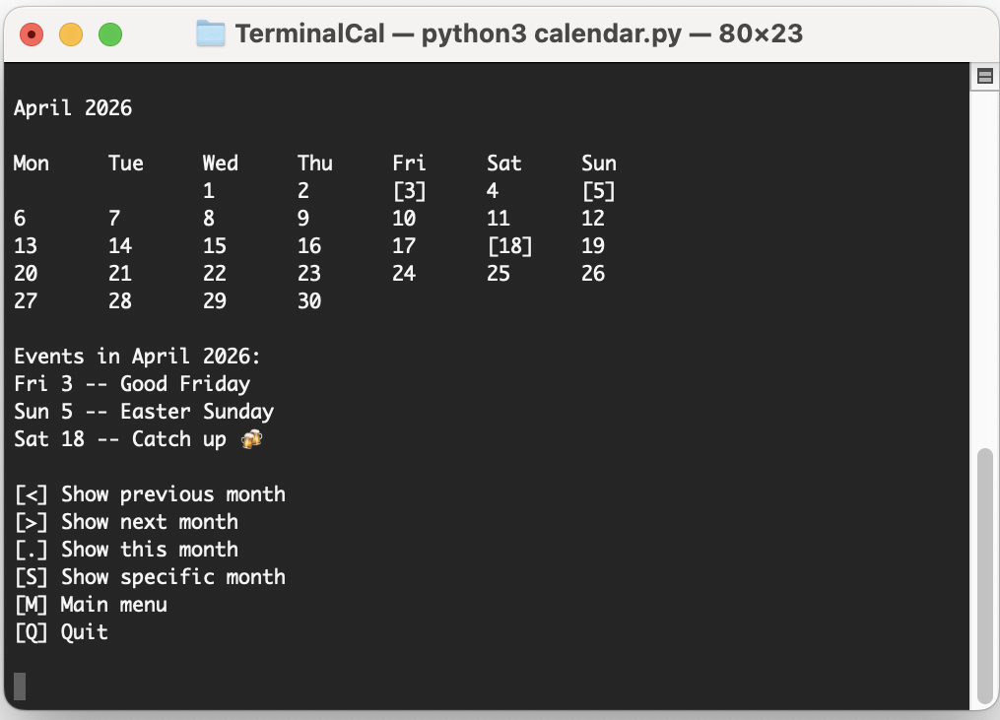

# TerminalCal

_**Note:** Originally started in Autumn 2025, first pushed to GitHub in August 2026._

**TerminalCal** is a very simple Python app that runs in the terminal and allows you to add and view upcoming events.

## Features

- **Calendar view** – See a month at a glance, as well as which events are coming up during that month.
- **List view** - See your upcoming events as a list
- **Settings** - Change settings such as 12h/24h clock and Monday/Sunday week start. Also choose between four languages: English, German, Spanish and Welsh.

## Known Issues & Future Improvements

- Currently pages are written as functions that call one another, leading to nested logic. The code will be rewritten to avoid this.
- Event dates must be written in YYYY-MM-DD format – in the future, natural language input will be more desireable.
- Support for more languages is also desireable.
